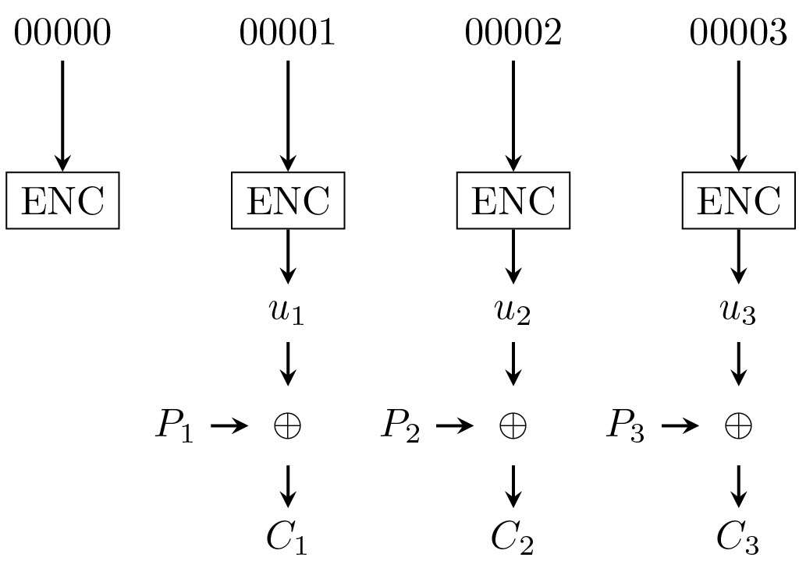
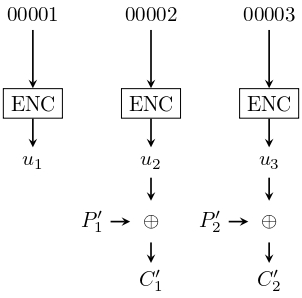

# Wolv CTF 2023

## keyexchange

**Description**: _Diffie-Hellman is secure right_

```python
#!/opt/homebrew/bin/python3

from Crypto.Util.strxor import strxor
from Crypto.Util.number import *
from Crypto.Cipher import AES

n = getPrime(512)

s = getPrime(256)

a = getPrime(256)
# n can't hurt me if i don't tell you
print(pow(s, a, n))
b = int(input("b? >>> "))

secret_key = pow(pow(s, a, n), b, n)

flag = open('/flag', 'rb').read()

key = long_to_bytes(secret_key)
enc = strxor(flag + b'\x00' * (len(key) - len(flag)), key)
print(enc.hex())
```

Với ba số nguyên tố $n, s, a$, server gửi mình số $s^a \pmod n$. Mình cần nhập số $b$ và server trả về $(s^a)^b \pmod n$. Mình chỉ cần chọn $b=1$ là `secret_key` sẽ là số $s^a \pmod n$ được nhận lúc nãy. Từ đó decrypt ra flag.

## Z2kDH

**Description**: _Sick of how slow it is to take the modulus of a large prime number? Tired of performing exponentiation over some weird group like ed25519? Just use the integers mod 2^k group with the unit g = 5! Efficient, reliable, doesn't require any hard math!_

```python
#!/usr/bin/python3

modulus = 1 << 258

def Z2kDH_init(private_exponent):
	"""
	Computes the public result by taking the generator 5 to the private exponent, then removing the last 2 bits
	private_exponent must be a positive integer less than 2^256
	"""
	return pow(5, private_exponent, modulus) // 4

def Z2kDH_exchange(public_result, private_exponent):
	"""
	Computes the shared secret by taking the sender's public result to the receiver's private exponent, then removing the last 2 bits
	public_result must be a non-negative integer less than 2^256
	private_exponent must be a positive integer less than 2^256
	"""
	return pow(public_result * 4 + 1, private_exponent, modulus) // 4

alice_private_exponent = int(open('alice_private_exponent.txt').read(), 16)
bob_private_exponent = int(open('bob_private_exponent.txt').read(), 16)

alice_public_result = Z2kDH_init(alice_private_exponent)
bob_public_result = Z2kDH_init(bob_private_exponent)

# These are sent over the public channel:
print(f'{alice_public_result:064x}') # Alice sent to Bob
print(f'{bob_public_result:064x}')   # Bob sent to Alice

alice_shared_secret = Z2kDH_exchange(bob_public_result, alice_private_exponent)
bob_shared_secret = Z2kDH_exchange(alice_public_result, bob_private_exponent)

assert alice_shared_secret == bob_shared_secret # the math works out!

# ...Wait, how did they randomly end up with this shared secret? What a coincidence!
```

Với output là

```
99edb8ed8892c664350acbd5d35346b9b77dedfae758190cd0544f2ea7312e81
40716941a673bbda0cc8f67fdf89cd1cfcf22a92fe509411d5fd37d4cb926afd
```

Gọi $a, b$ lần lượt là private key của Alice và Bob. Khi đó output trên tương đương với $(g^a \bmod p) // 4$ và $(g^b \bmod p) // 4$ với $p = 2^{258}$.

Như vậy mình cần bruteforce 2 bit cuối của mỗi public key và từ đó tìm ra private key của từng người. Cuối cùng thế vào hàm `Z2kDH_exchange` để tìm shared key là flag.

```python
from sage.all import *
from itertools import product
from Crypto.Util.number import long_to_bytes
from Crypto.Util.strxor import strxor

def Z2kDH_init(private_exponent):
	"""
	Computes the public result by taking the generator 5 to the private exponent, then removing the last 2 bits
	private_exponent must be a positive integer less than 2^256
	"""
	return pow(5, private_exponent, modulus) // 4

def Z2kDH_exchange(public_result, private_exponent):
	"""
	Computes the shared secret by taking the sender's public result to the receiver's private exponent, then removing the last 2 bits
	public_result must be a non-negative integer less than 2^256
	private_exponent must be a positive integer less than 2^256
	"""
	return pow(public_result * 4 + 1, private_exponent, modulus) // 4

g = 5
p = 2**258
modulus = p

c1 = int('99edb8ed8892c664350acbd5d35346b9b77dedfae758190cd0544f2ea7312e81', 16)
c2 = int('40716941a673bbda0cc8f67fdf89cd1cfcf22a92fe509411d5fd37d4cb926afd', 16)

#c1 = Mod(c1, p).log(Mod(g, p))
#c2 = Mod(c2, p).log(Mod(g, p))

for i, j in product(range(4), repeat=2):
	ct1 = c1 * 4 + i
	ct2 = c2 * 4 + j
	try:
		p1 = discrete_log(Mod(ct1, p), Mod(g, p))
		p2 = discrete_log(Mod(ct2, p), Mod(g, p))
		# print(long_to_bytes(int(p1)) + long_to_bytes(int(p2)))
		# print(strxor(long_to_bytes(int(p1)), long_to_bytes(int(p2))))
		shared1 = Z2kDH_exchange(c2, int(p1))
		shared2 = Z2kDH_exchange(c1, int(p2))
		print(shared1, shared2)
		assert shared1 == shared2
		print(long_to_bytes(shared1))
	except:
		continue
```

## Galois-t is this?

**Description**: _I'm expecting a super secret message... If you can give it to me, I'll give you a flag!_

```python
#!/usr/bin/python3
from Crypto.Cipher import AES
from Crypto.Random import get_random_bytes
from Crypto.Util.number import *
from Crypto.Util.strxor import *
import os
from pathlib import Path

def GF_mult(x, y):
    product = 0
    for i in range(127, -1, -1):
        product ^= x * ((y >> i) & 1)
        x = (x >> 1) ^ ((x & 1) * 0xE1000000000000000000000000000000)
    return product

def H_mult(H, val):
    product = 0
    for i in range(16):
        product ^= GF_mult(H, (val & 0xFF) << (8 * i))
        val >>= 8
    return product

def GHASH(H, A, C):
    C_len = len(C)
    A_padded = bytes_to_long(A + b'\x00' * (16 - len(A) % 16))
    if C_len % 16 != 0:
        C += b'\x00' * (16 - C_len % 16)

    tag = H_mult(H, A_padded)

    for i in range(0, len(C) // 16):
        tag ^= bytes_to_long(C[i*16:i*16+16])
        tag = H_mult(H, tag)

    tag ^= bytes_to_long((8*len(A)).to_bytes(8, 'big') + (8*C_len).to_bytes(8, 'big'))
    tag = H_mult(H, tag)

    return tag

FLAG = Path('flag.txt').read_text()

# 128-bit blocks
AES_BLOCK_SIZE = 16
key = get_random_bytes(16)
header = b'WolvCTFCertified'
message = b'heythisisasupersecretsupersecret'
used_nonces = set()

def incr(counter):
    temp = bytes_to_long(counter)
    return long_to_bytes(temp + 1, 16)[-16:]

def check_nonce(nonce):
    # if you can't reuse the nonce, surely you can't explot this oracle!
    if(nonce in used_nonces):
        print("Sorry, a number used once can't be used twice!")
        exit(0)
    used_nonces.add(nonce)

def encrypt(nonce, pt):
    pt = bytes.fromhex(pt)
    assert(len(pt) % 16 == 0)
    numBlocks = len(pt) // AES_BLOCK_SIZE
    if(numBlocks > 3):
        print("Sorry, we just don't have the resources to encrypt a message that long!")
        exit(0)

    nonce = bytes.fromhex(nonce)
    assert(len(nonce) == 16)
    check_nonce(nonce)

    cipher = AES.new(key, AES.MODE_ECB)
    hkey = cipher.encrypt(b'\0' * 16)
    enc = b''
    for i in range(numBlocks + 1):
        enc += cipher.encrypt(nonce)
        # the counter is just the nonce, right? right??
        nonce = incr(nonce)

    ct = b''
    for i in range(1, numBlocks + 1):
        ct += strxor(
            enc[i * AES_BLOCK_SIZE: (i+1) * AES_BLOCK_SIZE],
            pt[(i-1) * AES_BLOCK_SIZE: i * AES_BLOCK_SIZE])
        
    authTag = strxor(
        enc[:AES_BLOCK_SIZE],
        long_to_bytes(GHASH(bytes_to_long(hkey), header, ct)))
    
    return ct.hex(), authTag.hex()

def decrypt(nonce, ct, tag):
    ct = bytes.fromhex(ct)
    assert(len(ct) % 16 == 0)
    numBlocks = len(ct) // AES_BLOCK_SIZE

    nonce = bytes.fromhex(nonce)
    assert(len(nonce) == 16)
    check_nonce(nonce)

    tag = bytes.fromhex(tag)
    assert(len(tag) == 16)

    cipher = AES.new(key, AES.MODE_ECB)
    hkey = cipher.encrypt(b'\0' * 16)
    enc = b''
    for i in range(numBlocks + 1):
        enc += cipher.encrypt(nonce)
        # the counter is just the nonce, right?
        nonce = incr(nonce)

    pt = b''
    for i in range(1, numBlocks + 1):
        pt += strxor(
            enc[i * AES_BLOCK_SIZE: (i+1) * AES_BLOCK_SIZE],
            ct[(i-1) * AES_BLOCK_SIZE: i * AES_BLOCK_SIZE])
        
    authTag = strxor(
        enc[:AES_BLOCK_SIZE],
        long_to_bytes(GHASH(bytes_to_long(hkey), header, ct)))

    if(pt == message):
        if(authTag == tag):
            print(FLAG)
        else:
            print("Whoops, that doesn't seem to be authentic!", tag, authTag, key.hex())
    else:
        print("Hmm, that's not the message I was looking for...")

MENU = """
1. Encrypt
2. Submit
3. Exit
"""

def main():
    print("If you can send me a valid super secret super secret I'll give you a reward!")
    while len(used_nonces) < 3:
        print(MENU)
        command = input("> ")
        match command:
            case "1":
                nonce = input("IV (hex) > ")
                pt = input("Plaintext (hex) > ")
                ct, tag = encrypt(nonce, pt)
                
                print("CT: ", ct)
                print("TAG: ", tag)
            case "2":
                nonce = input("IV (hex) > ")
                ct = input("Ciphertext (hex) > ")
                tag = input("Tag (hex) > ")
                decrypt(nonce, ct, tag)
                exit(0)
            case other:
                print("Bye!")
                exit(0)
    print("I know encryption is fun, but you can't just keep doing it...")
        
if __name__ == "__main__":
    main()
```

Bài này thực chất là tính tag trong mode GCM của AES. Các bạn có thể xem thêm về mode CTR và GCM trong bài tìm hiểu lại Google CTF 2020 của mình (bài Pythia).

Trong bài này chúng ta có ba lần request với ba nonce khác nhau để encrypt hoặc decrypt.

Xét hàm `incr` mình thấy counter thực hiện cộng lên 1 ở mỗi bước.

Nếu mình bắt đầu từ $\mathrm{nonce}=0$, với ba block plaintext $P_1, P_2, P_3$ thì ciphertext tương ứng sẽ như sau.



Tại sao mình cần ba block plaintext trong khi `message` của mình là hai block ($32$ byte)? Vì ý tưởng của mình khi decrypt là gửi $\mathrm{nonce}=1$ lên, khi đó các giá trị trung gian (AES của counter) giữ nguyên với lúc encrypt.



_Lưu ý_ rằng ở hình 1, mình encrypt với $P = 0$ và $\mathrm{nonce} = 0$ nên mình sẽ có $C_i = u_i$. Ở hình 2 mình có $P'_i \oplus C'_i = P_{i+1} \oplus C_{i+1} = C_{i+1}$, nên mình sẽ tìm được $C'_i$ ứng với $P'_i$ là message ($C'_i = P'_i \oplus C_{i+1}$).

Vậy còn bước authentication?

Nhắc lại về cách tính tag. Trong $\mathrm{GF}(2^{128})$, giả sử với các ciphertext $C_1, C_2, \cdots, C_{n}$, với $H = \text{AES}_K(0^{128})$, $L = \mathrm{len}(A) || \mathrm{len}(C)$ và $I = \text{AES}_K (J_0)$ với $J_0$ là nơi bắt đầu counter.

Ở đây $n=2$, nghĩa là mình cần tìm $T = C_1 H^4 + C_2 H^3 + A H^2 + L H + I$ với $A$ là associated data (ở trong bài là header).

Ở đây chúng ta đã có $C'_1, C'_2, A, L, I$ ($I$ chính là $C_1$, các bạn thấy không? :v), vậy còn $H$?

Tới đây mình encrypt với $\mathrm{nonce}=2$ và ciphertext là chuỗi rỗng. Khi đó tag của mình là $T'' = A H^2 + L'' H + I$, nhưng $A$ đã bị pad bởi mấy số `0` ở cuối nên phép nhân `H_mult` luôn cho ra $0$, do đó $T'' = L'' H + I$ ($L'$ là vì lúc này $\mathrm{len}(C) = 0$). Như vậy mình có thể tìm $H$ rồi.

Như vậy quy trình giải bài này là:

* encrypt với $\mathrm{nonce}=0$ và $P_i = 0^{128}$ với $i=1,2,3$;
* encrypt với $\mathrm{nonce}=2$ và $P_i = \emptyset$;
* tính $H$ từ đó tính tag khi $\mathrm{nonce}=1$;
* decrypt với $C = \text{message}$ và $\mathrm{nonce}=1$.

Cám ơn các bạn đã đọc writeup của mình.

Code của mình ở [đây](https://github.com/dunglq2000/CTF/tree/master/2023/WolvCTF)
